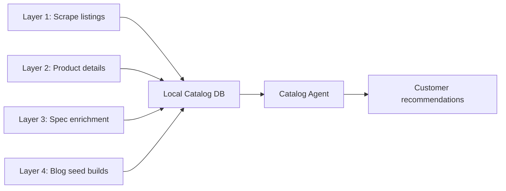

# PC Build Copilot — Data Strategy (No Phong Vũ DB Access)

**Companion to:** [SPEC.md](./SPEC.md), [techstack.md](./techstack.md)
**Version:** 1.0  
**Last updated:** 2026-06-27

---

## The Practical Answer

You do **not** need Phong Vũ's internal database to build a credible copilot. Their **public website already exposes real product data** — you mirror it into your own catalog, enrich specs for compatibility, and label anything that isn't live.

Use a **local catalog mirror** as the source of truth for your agents:

```
Phong Vũ public pages  →  your catalog-sync job  →  local DB/JSON  →  agents recommend from that
```

Your agents never query Phong Vũ's DB directly. They query **your snapshot**, refreshed on a schedule.

---

## What You Can Get Without DB Access

Phong Vũ category and product pages embed **`__NEXT_DATA__`** (Next.js JSON) with real commerce fields.

| Field | Available publicly |
|-------|-------------------|
| SKU ID | ✅ e.g. `260508255` |
| Product name | ✅ |
| Price / discount | ✅ `latestPrice`, `discountAmount` |
| Stock signal | ✅ `stockQuantity` |
| Brand, categories | ✅ |
| Product URL | ✅ |
| Short specs | ✅ `highlight` chips (e.g. "8GB GDDR6", "PCI-E 4.0") |
| Full description | ✅ HTML in `productDetail` |

**Example:** [VGA category](https://phongvu.vn/c/vga-card-man-hinh) returns dozens of `serverProducts` in one page load.

### What's harder without official API

- Socket, TDP, GPU length, PSU connectors (not always structured)
- Showroom-level stock
- Real cart/checkout
- Internal promo rules

Handle these with **enrichment + rules + honest disclaimers**.

---

## Recommended 4-Layer Data Strategy



### Layer 1 — Category scraping (bulk SKUs)

Crawl Phong Vũ category URLs your copilot needs:

| Category | URL pattern |
|----------|-------------|
| CPU | `/c/cpu` |
| Mainboard | `/c/mainboard-bo-mach-chu` |
| RAM | `/c/ram` |
| VGA | `/c/vga-card-man-hinh` |
| SSD | `/c/o-cung-ssd` |
| PSU | `/c/psu-nguon-may-tinh` |
| Case | `/c/case-thung-may-tinh` |
| Cooler | `/c/tan-nhiet-pc` |
| Monitor | `/c/man-hinh-may-tinh` |

**Extract:** parse `__NEXT_DATA__` → `props.pageProps.serverProducts[]`

**You get:** sku, name, price, stock, brand, category, highlight specs.

**Tools:** Python + `httpx` + `BeautifulSoup`/`regex`, or **Playwright** if pages are dynamic. AABW partners **TinyFish** / **Bright Data** help if rate-limited.

---

### Layer 2 — Product detail pass (richer context)

For each SKU in your shortlist (or top N per category), fetch the product page and extract:

- `productInfo` (SKU, warranty, slug)
- `prices[]` (promo breakdown)
- `productDetail.description` (HTML → text for LLM context)

Use this for explanations, not for hard compatibility rules.

---

### Layer 3 — Spec enrichment (compatibility engine fuel)

Listing data alone won't give you `socket=LGA1700` or `gpu_length_mm=310` in a clean field. Enrich in three passes:

| Pass | Method | Example |
|------|--------|---------|
| **A. Name parsing** | Regex rules | "Ryzen 7 7800X3D" → AM5; "RTX 5060 Ti" → GPU tier |
| **B. Highlight parsing** | Parse `highlight` HTML chips | "8GB GDDR6", "PCI-E 4.0" |
| **C. Curated overrides** | Manual JSON for top ~100 SKUs | `sku_specs_overrides.json` |

For hackathon scope: **curate 50–150 SKUs** across price bands (10M–40M builds) rather than indexing all 10,000+ products. Phong Vũ's own blog configs are good anchors:

- [Build PC gaming 20 triệu](https://phongvu.vn/cong-nghe/build-pc-gaming-20-trieu/)
- [Build PC gaming 30 triệu](https://phongvu.vn/cong-nghe/huong-dan-build-pc-gaming-30-trieu/)
- [Build PC cơ bản](https://phongvu.vn/cong-nghe/build-pc-gaming-co-ban/)

Extract SKUs from those articles → priority enrichment list.

**Optional:** one-time LLM batch job reads product descriptions and proposes structured specs → **human verifies** before saving to `sku_specs`.

---

### Layer 4 — Seed builds (ground truth for demos)

Store 10–20 **reference builds** Phong Vũ already publishes (20M/30M gaming, office, creator). Use them to:

- Validate your optimizer output
- Demo "same quality as Phong Vũ expert config"
- Bootstrap when catalog search returns nothing

---

## How Agents Recommend Without Live DB

```
User: "PC gaming 25 triệu, Valorant 144fps"
        ↓
Intent Agent → budget=25M, use_case=gaming, games=[Valorant]
        ↓
Catalog Agent → query LOCAL catalog:
                  category=VGA, price <= 12M, in_stock=true
        ↓
Compatibility Agent → rules on enriched specs (code, not LLM)
        ↓
Optimizer Agent → pick best combo under 25M
        ↓
Explainer Agent → Vietnamese rationale from catalog fields
        ↓
Output: parts list + links to phongvu.vn product pages
```

### Cart / checkout without Teko API

Generate a **mock cart payload** with real SKUs + link list:

> "Mở từng sản phẩm trên Phong Vũ để thêm vào giỏ"

Or deep links: `https://phongvu.vn/...--s{sku}`

Judges care that SKUs are **real and purchasable**, not that you integrated Teko cart on day one.

---

## Local Storage Options

| Option | Best for |
|--------|----------|
| **`catalog.json` + git** | Fastest hackathon start, 100–300 SKUs |
| **SQLite** | Simple queries, no server |
| **PostgreSQL + Typesense** | Full spec stack (see [techstack.md](./techstack.md)) |

### Minimal SKU schema

```json
{
  "sku": "260508255",
  "name": "VGA ASUS RX 7600 8GB",
  "category": "vga",
  "price_vnd": 6990000,
  "stock_quantity": 1000,
  "url": "https://phongvu.vn/vga-asus-...--s260508255",
  "brand": "asus",
  "specs": {
    "vram_gb": 8,
    "memory_type": "GDDR6",
    "pcie": "4.0",
    "tdp_w": 165,
    "length_mm": null
  },
  "specs_confidence": "partial",
  "catalog_snapshot_at": "2026-06-27T00:00:00Z"
}
```

Use `specs_confidence: "verified" | "partial" | "inferred"` so the UI can say when data is estimated.

---

## Teko Public APIs (Advanced, Optional)

Phong Vũ's frontend references Teko consumer endpoints:

- `discovery.tekoapis.com`
- `listing.tekoapis.com`
- `consumer-bff.tekoapis.com`

These typically need **platform/terminal headers** the browser sends — not documented for public hackathon use.

**Practical approach:**

1. Start with `__NEXT_DATA__` scraping (simpler, same data the site shows).
2. At AABW (problem statements drop **July 1**), ask Phong Vũ/Teko mentors for read-only catalog access.
3. Design `CommerceAdapter` interface now → swap mock for real API later.

---

## What to Show Users (Trust & Honesty)

| UI element | Purpose |
|------------|---------|
| **"Dữ liệu cập nhật: DD/MM/YYYY"** | Snapshot transparency |
| **Link each part** to `phongvu.vn` | Proves real products |
| **"Giá có thể thay đổi"** | No live DB disclaimer |
| **Compatibility warnings** | "PSU estimated — confirm at showroom" when `specs_confidence=partial` |
| **"Tư vấn từ chuyên gia"** button | Fallback to Messenger (what Phong Vũ does today) |

---

## Minimum Viable Catalog for Hackathon

You don't need the full Phong Vũ catalog. Target:

| Category | SKUs to curate |
|----------|----------------|
| CPU | 15–20 (i5/i7/Ryzen 5/7, common sockets) |
| Mainboard | 15–20 (B760, B650, X870…) |
| RAM | 10–15 |
| VGA | 20–30 (RTX 5050–5070 Ti, some AMD) |
| SSD | 10 |
| PSU | 10–15 |
| Case | 10 |
| Cooler | 8–10 |
| Monitor | 10–15 |

**~120–150 SKUs** covers most demo builds from 15M–40M VND.

---

## Sync Job (Run Once, Re-run Weekly)

```bash
# Pseudocode pipeline
1. crawl_categories()      → raw_products.jsonl
2. fetch_product_details() → enrich descriptions
3. enrich_specs()          → merge overrides + parsers
4. validate_catalog()      → flag missing socket/tdp
5. index_search()          → Typesense / SQLite FTS
6. tag snapshot version    → catalog_v2026_06_27
```

Run before build day; during demo, static snapshot is fine.

---

## Bottom Line

| Question | Answer |
|----------|--------|
| Can I suggest real products? | **Yes** — scrape public `__NEXT_DATA__` |
| Can I show real prices? | **Yes** — from same JSON (with snapshot date) |
| Can I check compatibility? | **Yes** — enrich specs + rules engine on your side |
| Can I add to cart live? | **Not without Teko API** — use product links or mock cart |
| Is this acceptable at AABW? | **Yes** — self-contained data is explicitly allowed; deployment conversation comes after |

You're not blocked. The path is:

**public web → local catalog → agents → real Phong Vũ product links**

---

*PC Build Copilot — Data Strategy — Phong Vũ Retail Track*
